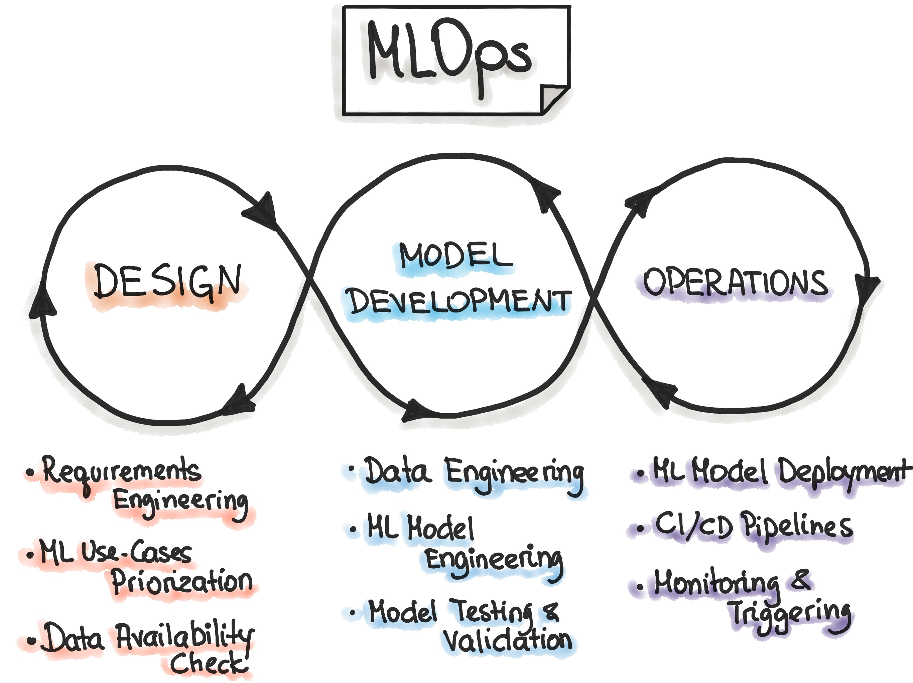

# Laboratorio de Minería de Datos - ISTEA

Este repositorio contiene el material y prácticas de la materia **Laboratorio de Minería de Datos**, enfocadas en la aplicación de técnicas de minería de datos y el rol de **MLOps** en el ciclo de vida de modelos de machine learning.

## Contenidos

### 1. Fundamentos de Minería de Datos
- Preprocesamiento y limpieza de datos.
- Exploración de datos y análisis descriptivo.
- Selección de características y reducción de dimensionalidad.

### 2. Introducción a MLOps
- Conceptos clave y ciclo de vida de modelos.
- Automatización del flujo de trabajo en machine learning.
- Integración de ML en entornos productivos.

### 3. Pipeline de Machine Learning
- Versionado de datos y modelos.
- Entrenamiento y evaluación reproducible.
- Monitorización y mantenimiento de modelos.

### 4. Despliegue y Escalabilidad
- Implementación en entornos productivos (Docker, Kubernetes).
- APIs para modelos de machine learning (Flask, FastAPI).
- Estrategias de escalado y optimización.

## Uso
Cada módulo incluye notebooks y scripts explicativos. Revisa la carpeta `nbs/` para ejemplos prácticos.

